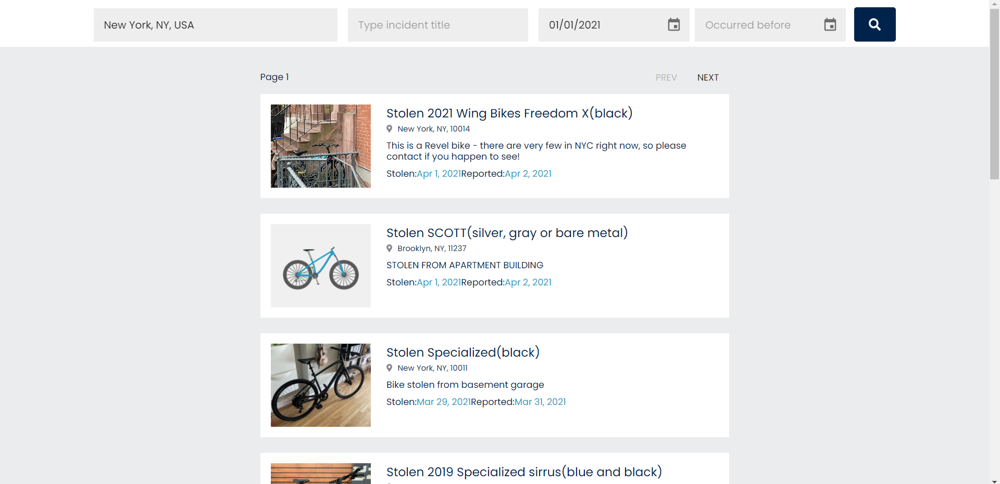

# Stolen Bike Index

Stolen bike index is a web app where you can search stolen/missing bikes.

## How to run the project locally

To clone and run this application, you'll need [Git](https://git-scm.com/) and [node.js](https://nodejs.org/en/) (which comes with [npm](https://www.npmjs.com/)) installed on your computer. From your command line.

    // Clone the repository  
    $ git clone https://github.com/JustAyush/stolen-bike-index

    // Go into the repository  
    $ cd stolen-bike-index

    // Install dependencies
    $ npm install

    // Run the app
    $ npm start

Note: Google Maps API key is required for searching locations. Create a new file 
in the root directory and name it .env and place your API key (see .env.sample).

## Project Structure

This project was bootstrapped with [Create React App](https://github.com/facebook/create-react-app). 
The major project structure is highlighted below.

    stolen-bike-index/
      node_modules/
      public/
      src/
        assets/              // contains images, theme, global styles 
        components/          // presentational components
          card/
            index.jsx        // card component
            Card.style.js    // styles for the card component
            Card.test.js     // test suites for the card component
          ...
          index.js           // exports all components 
        constants/           // constants for the entire project scope 
          index.js           
        layouts/
          PageLayout.jsx     // Main Layout of the app
          index.js           // exports all layouts
        pages/               // components that render the pages
          home/
          index.js           // exports all pages
        services/
          httpService.js     // service for the axios call
        utils/               // helper functions
      App.jsx
      config.js              // configurations for the entire project scope
      .env
      .eslintrc.json         // ESLint plugins and rules
      .prettierrc            // Prettier configurations
      package.json
      README.md

## File and folder naming conventions

React Components -> Pascal Case ending with .jsx (PageLayout.jsx or index.js)  
Styles -> Pascal Case ending with .style.js (PageLayout.style.js)  
Test Suites -> Pascal Case ending with .test.js (PageLayout.test.js)  
Folder -> hyphen case (page-layout)  
Other JavaScript Files -> camelCase (httpService.js)

## Limitations

[API](https://www.bikewise.org/documentation/api_v2) used to fetch the incidents doesn't contain total incident count in its response.
  For the same reason, the total incidents and the total pages have not been mentioned in the search result.
  The user may get 'No Result Found' as he/she is going through next pages because the availability or inavailability of
  the incidents is not known beforehand.

